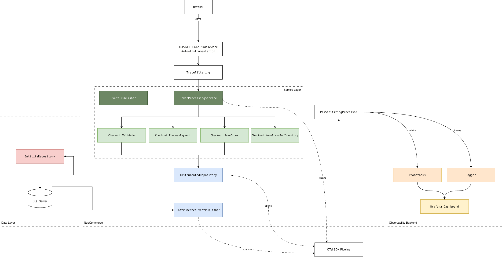

### 1. Architecture Analysis

#### 1.1 Layer Organization and Dependency Rules

nopCommerce follows a strict **layered architecture** with unidirectional dependencies, no layer references a layer above it.

**Concrete dependency graph:**

- **Nop.Core** → no internal dependencies (only NuGet: Autofac, AutoMapper, Azure.Identity)
- **Nop.Data** → Nop.Core (adds FluentMigrator, linq2db, SQL/MySQL/Postgres drivers)
- **Nop.Services** → Nop.Data + Nop.Core (adds MailKit, ClosedXML, SkiaSharp)
- **Nop.Web.Framework** → Nop.Services + Nop.Data + Nop.Core (adds FluentValidation, WebMarkupMin)
- **Nop.Web** → all four layers above
- **Plugins** (30+) → Nop.Web (which transitively exposes all layers)

This layering exhibits **data coupling** between layers (the healthiest form per the course material on coupling types). Layers communicate through well-defined interfaces and data parameters, not through shared global state or control flags.

**Service registration and bootstrapping:** Services are wired via dependency injection using a custom `INopStartup` interface. Any class implementing it is discovered at runtime by `ITypeFinder` (assembly scanning), instantiated, and called in ascending `Order`:

| Order | Startup Class | Responsibility |
|-------|--------------|----------------|
| 10 | `NopDbStartup` | Repositories, migrations, generic `IRepository<T>` |
| 100 | `NopCommonStartup` | Sessions, HTTP clients, caching, localization |
| 400 | `NopRoutingStartup` | Routing, rate limiting |
| 500 | `AuthenticationStartup` | Authentication middleware |
| 2000 | `NopStartup` | 80+ business services (Product, Order, Customer, Payment...) |
| 3000+ | Plugin startups | Plugin-specific registrations |

Almost all business services are registered as **Scoped** (one instance per HTTP request) and resolved through interfaces, e.g., `services.AddScoped<IProductService, ProductService>()`. This follows the **Dependency Inversion Principle (DIP)**: high-level modules depend on abstractions, not concrete implementations. It is also what makes the **decorator pattern** viable for adding observability without modifying existing code.

#### 1.2 IEventPublisher: Internal Event Mechanism

nopCommerce uses an in-process publish/subscribe event system that represents **message coupling**, the loosest form of coupling between modules that still communicate.

**Interface** (`Nop.Core/Events/IEventPublisher.cs`):

```csharp
public partial interface IEventPublisher
{
    Task PublishAsync<TEvent>(TEvent @event);
}
```

The implementation (`Nop.Services/Events/EventPublisher.cs`) resolves all `IConsumer<TEvent>` instances from the DI container and calls them **sequentially and synchronously** within the same HTTP request. There is no message queue or background processing. If a consumer throws, the exception is logged and the next consumer runs. This makes the event system closer to **orchestration** than choreography: the publisher coordinates execution and failure is handled centrally.

**Automatic entity events:** The data layer (`EntityRepository<T>`) publishes `EntityInsertedEvent<T>`, `EntityUpdatedEvent<T>`, and `EntityDeletedEvent<T>` after every database write. This is controlled by a `publishEvent = true` parameter on repository methods.

**Custom domain events** exist for key business moments:

| Event | When Published |
|-------|---------------|
| `OrderPlacedEvent` | After all order data is saved to DB |
| `OrderPaidEvent` | When payment status transitions to Paid |
| `OrderStatusChangedEvent` | On any order status transition |
| `ShoppingCartItemMovedToOrderItemEvent` | Per cart item during order creation |
| `CustomerLoggedinEvent` | After successful authentication |
| `TaxRateCalculatedEvent` | After tax calculation per product |

Consumers follow the **Single Responsibility Principle**, each handling one concern. The primary consumer pattern is **cache invalidation** (e.g., `ModelCacheEventConsumer` clears cached presentation models when entities change).

**Why this matters for observability:** `IEventPublisher` is a natural **instrumentation boundary**. A single decorator on this interface (following the DI + Decorator pattern from the course slides) captures every meaningful business event without touching any business logic.

#### 1.3 Where the Code Makes Observability Easy

Applying the course's decision flowchart for cross-cutting concerns: *"Does it apply to every HTTP request? → Middleware. Do you need to swap implementations? → DI. Add behaviour to a specific object? → Decorator."*

| Component | Pattern to Use | Why It's Easy |
|-----------|---------------|---------------|
| **HTTP request pipeline** | **Middleware** | Standard ASP.NET Core pattern, ordered via `INopStartup`. OTel middleware slots in at a low `Order` value. |
| **`IRepository<T>`** | **Decorator** | Single generic interface for all DB access. One decorator wraps every query/insert/update/delete with spans. |
| **`IStaticCacheManager`** | **Decorator** | All cache operations through one interface. Measures hit/miss rates and acquire times. |
| **`IEventPublisher`** | **Decorator** | All domain events pass through one method. Emits spans per event type. |
| **HTTP clients** | **DI** | 5 named `HttpClient` registrations. `AddHttpMessageHandler<>()` adds automatic tracing. |
| **Exception handling** | **Middleware** | Single centralized handler in `ApplicationBuilderExtensions`. One hook for `Activity.Current?.RecordException()`. |

All services use interfaces, all classes are `partial` with virtual methods, and there are no sealed service classes. This means the **Open/Closed Principle** is satisfied: we can extend behavior through decoration without modifying existing tested code.

#### 1.4 Where the Code Makes Observability Hard

| Component | Problem | Coupling Type |
|-----------|---------|---------------|
| **`EngineContext.Current`** | Static service locator used in middleware and `EventPublisher` to resolve services. Cannot intercept via DI. | **Common coupling**: multiple modules depend on shared global state. |
| **LINQ2DB (not EF Core)** | No built-in `DiagnosticSource` integration. Automatic SQL query tracing is unavailable. | **External coupling**: tied to library limitations. |
| **Large constructors** | Services like `OrderProcessingService` inject 30–50+ dependencies. Writing a full decorator for each is tedious. | Symptom of low cohesion, too many reasons to change (**SRP concern**). |
| **Custom `ILogger`** | Logs to database via `IRepository<Log>`, not integrated with `Microsoft.Extensions.Logging`. Cannot correlate with `trace_id`/`span_id`. | **Content coupling**: logging reaches into data layer internals. |
| **Static utility methods** | `DataSettingsManager.IsDatabaseInstalled()` called in hot paths. Invisible to instrumentation. | Static methods violate **DIP**: callers depend on concretes, not abstractions. |

#### 1.5 Structural Changes: Worth Making vs. Not

Following the course principle of **minimal surgical changes** (don't refactor what you don't need to):

**Worth making (low impact, high value):**

1. **Add an `INopStartup` for OpenTelemetry** (Order ~5) that registers OTel SDK, middleware, and exporters. The startup discovery mechanism handles everything with zero changes to existing code. Follows **OCP**: new behavior through a new class.

2. **Register decorators** for `IRepository<T>`, `IStaticCacheManager`, and `IEventPublisher` to wrap infrastructure boundaries with tracing spans. Achieved entirely through DI registration. This is the **DI + Decorator pattern** from the course slides applied directly.

3. **Add `ActivitySource` spans inside `OrderProcessingService.PlaceOrderAsync()`**, the one surgical change. This method orchestrates the entire checkout flow and built-in ASP.NET instrumentation does not reach into it. A few `using var activity = ...` lines at key sub-steps provide the span hierarchy needed.

4. **Add a PII-sanitizing OTel processor**, applying the course's guidance on **redaction at the SDK layer** ("earlier redaction gives stronger guarantees"). A single processor strips sensitive attributes before export.

**Not worth making:**

- Replacing `EngineContext.Current` with proper DI, since it would be a massive refactor across dozens of files for marginal observability gain.
- Switching from LINQ2DB to EF Core for `DiagnosticSource` support, as it would require a fundamental data layer rewrite.
- Replacing the custom `ILogger` with `Microsoft.Extensions.Logging`, since it would break plugin compatibility.

---

### 2. Architecture Diagram



#### Custom Metrics

| Metric | Type | Tags | Operational Justification |
|--------|------|------|--------------------------|
| `nopcommerce.checkout.step.duration` | Histogram | `step` | Breaks checkout into individually observable segments. If payment step latency doubles at 2 AM, the on-call engineer checks the payment gateway, not the database. |
| `nopcommerce.checkout.outcome` | Counter | `outcome` | Classifies every checkout attempt (success, payment_failed, validation_failed, error). A spike in `payment_failed` pages the payments team. |
| `nopcommerce.checkout.cart_size` | Histogram | — | Tracks items per order. A sudden drop may indicate add-to-cart or bundling issues. |
| `nopcommerce.checkout.payment_method_usage` | Counter | `payment_method` | If a payment provider drops to zero, that plugin is likely down. |
| `nopcommerce.checkout.revenue` | Counter | — | Running sum of order totals in cents. If revenue/min drops to zero while HTTP 200s flow, checkout is silently broken. |
| `nopcommerce.checkout.items_purchased` | Counter | `product_name` | Units sold per product. Enables top-selling product ranking. |

#### PII Exclusion

A `PiiSanitizingProcessor` (custom `BaseProcessor<Activity>`) runs on every span before export. It redacts any attribute whose key matches known PII patterns (email, card number, CVV, address, phone). This is a safety net at the SDK layer — individual instrumentation points do not need to remember which fields to exclude.
